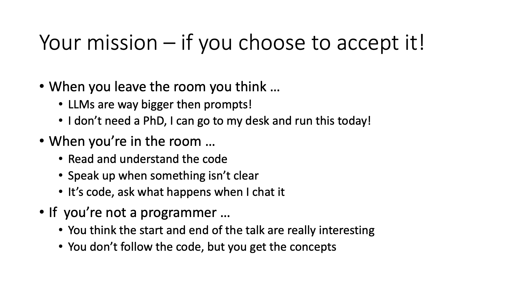

## From writing prompts to creating programs

In a time long ago, programmers wrote in assembly language, fine-tuned for their processor, and had to write the support systems they required, like compilers, libraries, and operating systems to manage memory, network, and disk.

Today, with "LLVM programming", the prompt is not the program, but the assembly language tuned for a processor. We programmers need to rebuild the compiler, OS, libraries, and memory subsystems, and I'll show you how.

In the transition from pre-web to mobile, many concepts unimaginable in the pre-web world are the default approach taken today. We can begin to grasp these same types of concepts with LLVMs, and we'll uncover those as we go through the code.

#### The before we get our hands dirty context

Download the [Powerpoint](building_systems_with_llms.pptx).

#### The code we go through:

[Jupyter Notebook](https://github.com/idvorkin/ai_talk/blob/main/coding_llms.ipynb)

If you want to follow along, you can run the notebook locally:

### How to run the code yourself

#### Build

Install docker and docker-compose

    Use your favorite method

Clone the repo

    git clone https://github.com/idvorkin/ai_talk

Build the service

    docker-compose build talk

#### Run

    # set your OPENAPI_KEY, it's passed in as an environment variable
    ./run.me

    # reset your password if required
    ./reset_password

Open jupyter [locally](http://localhost:8888)

